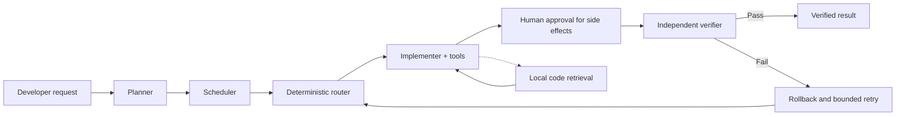
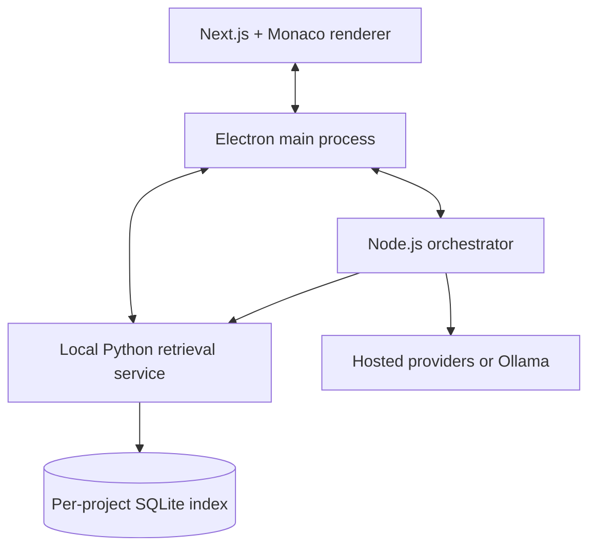

# CodéNawabs — Resource-Efficient Agentic Coding IDE

> **High productivity from a lightweight local stack.**
>
> CodéNawabs is a Monaco-based desktop coding environment with a multi-agent orchestration system designed to deliver reliable agentic coding workflows without requiring heavyweight infrastructure, large local models, or expensive always-on services.

## The problem

Modern agentic coding systems can be powerful, but they often come with significant costs:

- They require large models, high-end GPUs, or substantial cloud budgets.
- They consume large context windows by sending entire files and repositories to models.
- They rely on opaque agent loops that can repeat failed actions, waste tokens, or make uncontrolled changes.
- They can be difficult to run locally because they depend on multiple databases, vector services, and infrastructure components.
- When an agent makes a mistake, recovery is often manual and previous work may be difficult to resume.

This creates a gap for students, developers, small teams, and machines with limited hardware: the productivity benefits of agentic development are attractive, but the operational and resource requirements are not.

## Our solution

CodéNawabs addresses this gap with a **resource-conscious, bounded, and observable agent architecture**. Instead of depending on one massive model or an infrastructure-heavy platform, it combines several focused techniques:

1. **Task decomposition** — complex requests are divided into focused subtasks.
2. **Deterministic model routing** — each subtask is assigned to an eligible model based on capability, context needs, cost, speed, and availability.
3. **Small, relevant context** — retrieval supplies targeted code snippets instead of blindly sending entire files.
4. **Independent verification** — completed work is checked by a separate verification step.
5. **Backtracking and bounded retries** — failed attempts are rolled back instead of accumulating broken changes.
6. **Human-controlled side effects** — edits and shell commands require explicit approval.
7. **Local-first services** — indexing, orchestration, persistence, and retrieval run as lightweight local processes.

The result is an agentic coding workflow that aims to achieve the productivity of more expensive orchestration systems while using considerably fewer hardware and software resources.

## Core selling points

### 1. High productivity with modest resources

CodéNawabs is designed to work with small and mid-sized hosted or local models rather than requiring a single frontier-scale model. It can use free-tier providers, low-cost hosted models, or local Ollama models, allowing users to choose the best balance between quality, speed, privacy, and cost.

The system improves the effectiveness of smaller models through orchestration rather than brute force:

- Planning converts a large task into manageable steps.
- Routing sends each step to an appropriate model.
- Verification catches errors before they spread.
- Backtracking gives failed attempts a clean starting point.
- Context compaction prevents unnecessary context growth.

### 2. No heavyweight infrastructure requirement

The system is intentionally built around lightweight components:

- Electron and Next.js for the desktop IDE.
- A standalone Node.js orchestrator process.
- A local Python retrieval service.
- SQLite with FTS5 and `sqlite-vec` instead of a separate vector database server.
- Local JSONL event logs and snapshots for persistence.
- Optional Ollama support for local inference.

There is no requirement for a cluster, a dedicated orchestration server, or a continuously running external vector database. The application can run as a self-contained desktop development environment.

### 3. Efficient code retrieval

The retrieval pipeline is built to reduce both model context usage and latency:

- AST-aware chunking keeps functions, methods, and classes intact.
- BM25 keyword search handles exact identifiers, error messages, and configuration keys.
- Vector search handles semantic similarity.
- Call and import graph expansion helps locate related code.
- Reciprocal Rank Fusion combines retrieval signals.
- Reranking improves the final result quality.
- Weak retrieval is detected and recovered through bounded widening rather than an expensive model-based rewrite loop.

This lets agents see the code that matters without automatically loading an entire repository into context.

### 4. Cost and runaway-loop control

Agentic systems can lose time and money through repeated tool calls, failed retries, or unnecessarily large contexts. CodéNawabs treats resource usage as a first-class design constraint:

- Maximum retries per subtask.
- Maximum tool-calling steps per subtask.
- Maximum token budget per subtask.
- Detection of repeated identical tool calls.
- Task-level cost and time ceilings.
- Reserve margins before dispatching additional model calls.
- Automatic reduction of parallelism as the budget becomes tight.
- Bounded re-planning instead of unlimited self-modification of the task plan.

Every intervention is surfaced to the dashboard so the user can understand why the system stopped, retried, or changed course.

### 5. Safe, reviewable code changes

CodéNawabs does not allow agent side effects to happen silently:

- File edits are presented as unified diffs.
- Individual diff blocks can be accepted or rejected.
- Shell commands require approval.
- State-changing Git operations use the same approval-gated path.
- File changes are checked against the latest file contents before application.
- Failed subtasks can be rolled back independently, including during parallel execution.

The agent remains productive without taking control away from the developer.

### 6. Resilient execution

Tasks are persisted as append-only event logs and atomic snapshots. If the application crashes or is closed, the task can be resumed from its latest durable state. Subtasks that were interrupted during execution are safely returned to a retryable state rather than being treated as successfully completed.

The architecture also degrades gracefully:

- Missing embedding dependencies fall back to keyword retrieval.
- Unsupported languages fall back to line-based chunks.
- Reranking failures fall back to heuristic ranking.
- Provider failures trigger health-aware failover.
- Unavailable local models do not prevent hosted models from being used.

## How it works



The complete workflow is:

**decompose → retrieve → route → execute → review → verify → backtrack → re-plan → aggregate**

## Architecture



### Main components

| Component | Purpose |
|---|---|
| **Monaco editor** | Familiar code editing experience with tabs, file tree, terminal, and diff review. |
| **Electron shell** | Secure desktop integration, workspace access, provider health checks, terminal, and IPC. |
| **Orchestrator** | Planning, scheduling, routing, tool execution, verification, backtracking, and persistence. |
| **Retrieval service** | AST-aware indexing and hybrid code search using Python, SQLite, FTS5, and optional vector search. |
| **Model providers** | Groq, OpenRouter, Ollama, Gemini, and other compatible routes configured by the user. |
| **Observability dashboard** | Execution graph, routing decisions, model calls, token usage, costs, approvals, and interventions. |

## Why it is resource-efficient

CodéNawabs reduces resource consumption at several layers:

- **Model resources:** uses the smallest suitable model for each task instead of the most powerful model for every task.
- **Context resources:** retrieves focused snippets and compacts old conversation history.
- **Compute resources:** uses ONNX-based embeddings rather than requiring a large PyTorch installation or GPU stack.
- **Storage resources:** keeps project indexes in isolated SQLite files rather than operating a separate database service.
- **Network resources:** avoids unnecessary model calls for routing, query recovery, and simple deterministic decisions.
- **Developer resources:** provides a single desktop application instead of requiring users to assemble and operate multiple services.

This is the central design principle: **use orchestration, retrieval, and verification to multiply the value of modest models instead of solving every problem with more hardware.**

## Features at a glance

- Monaco-based desktop coding environment.
- Multi-agent planner, implementer, verifier, tie-breaker, and compactor roles.
- Deterministic, cost-aware model routing.
- Hosted and local model support.
- Hybrid BM25 + vector + call-graph code retrieval.
- AST-boundary code chunking with language-aware parsing.
- Human approval for edits and commands.
- Partial diff approval.
- Automatic backtracking after failed verification.
- Bounded retries and bounded re-planning.
- Parallel subtask execution with file-conflict protection.
- Crash recovery and resumable tasks.
- Live model health checks and provider failover.
- Execution graph and detailed observability dashboard.
- Graceful degradation when optional dependencies are unavailable.

## Quick start

### Prerequisites

- Node.js 20 or newer.
- Python 3.10 or newer.
- A compiler toolchain for native Node dependencies such as `node-pty`.
- At least one configured model provider, or a local Ollama installation.

### Install

```bash
npm install

python3 -m venv retrieval-service/.venv
retrieval-service/.venv/bin/pip install -r retrieval-service/requirements.txt
```

### Run

```bash
npm run dev
```

Open **Settings** in the application and configure one or more providers. Supported options include hosted providers such as Groq, OpenRouter, and Gemini, as well as local Ollama models.

### Validate the installation

```bash
npm run typecheck
npm test
npm run verify:models
```

For local inference, install Ollama and pull a compatible model, for example:

```bash
ollama serve
ollama pull qwen2.5-coder:7b
```

## Build desktop installers

Build the installer on the target operating system:

```bash
npm run dist:linux
npm run dist:win
npm run dist:mac
```

Build outputs are written to `release/`. See the project documentation for platform-specific packaging requirements and Python retrieval-service setup.

## Repository structure

```text
.
├── electron/              Desktop shell, IPC, terminal, health checks
├── orchestrator/          Planner, scheduler, router, tools, budgets, persistence
├── retrieval-service/     AST indexing, hybrid retrieval, embeddings, reranking
├── src/                   Next.js UI, editor, chat, dashboard, settings, diffs
├── tests/                 Orchestrator, retrieval, recovery, routing, and UI-support tests
├── docs/                  Additional documentation and local-model guidance
└── README.md              Project overview and getting started guide
```

## Design principles

### Lightweight by default

Prefer local processes, embedded storage, deterministic algorithms, and small models over infrastructure that is expensive to install, operate, or scale for a desktop developer workflow.

### Quality through cooperation

A planner, implementer, verifier, and retrieval system can collectively outperform a single model operating with an oversized prompt. Each component has a focused responsibility.

### Bounded autonomy

Autonomy is useful only when it is observable, reversible, and limited by clear resource and safety boundaries.

### Graceful degradation

Optional capabilities should improve the experience without becoming single points of failure. The core workflow should remain useful when embeddings, reranking, a provider, or a language grammar is unavailable.

### Human ownership of changes

The system accelerates implementation while keeping the developer in control of every consequential file or shell change.

## Current limitations

- Full semantic retrieval requires the optional Python dependencies and model caches.
- Unsupported languages use line-window fallback chunking.
- Local Ollama performance depends on the host machine and selected model.
- Provider model catalogues and pricing can change over time; verify them before a demonstration.
- Backtracking covers orchestrator-controlled edits. External mutations performed by approved shell commands may require manual recovery.
- The system is optimized for a single-user desktop workflow rather than multi-tenant server deployment.

## Project status

CodéNawabs is an active engineering project and research-oriented prototype focused on demonstrating that effective agentic coding does not have to require frontier-scale infrastructure. The architecture, tests, and observability tools are designed to make the system practical to evaluate, explain, and extend.

## License

Add the project license here when the repository license is finalized.
