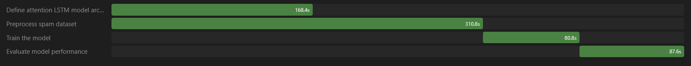

# Test Report Log

This document records formal test cases executed against the IDE. Each test entry is kept separate so new cases can be added sequentially without altering the structure of previous entries.

---

## Test Entry 01

### 1. Test Metadata
- Test ID: TEST-001
- Repository: https://github.com/skm183/TestRepoForCodeNawabs/
- Date: Not specified
- Status: Completed with follow-up fix

### 2. Prompt Given
Create a Next.js app with JWT authentication, including basic login, sign-up, and dashboard pages, then Dockerize it.

### 3. Initial Project State
- Initial files present: unrelated HTML, CSS, and JavaScript files from a previous testing task.
- Observation: The orchestrator identified that these files were unrelated and removed them before starting from a clean base.

### 4. Execution Summary
The initial project generated by the IDE contained Docker-related issues. After the error was copied back into the prompt, the system corrected the build issue and produced a working application.

### 5. First Attempt Result
- Outcome: Build failed due to Dockerfile issue
- Cost: $0.049
- Time: 658s
- Calls: 76
- Tokens: 269,850
- Notes: The generated project was close to working but failed while copying the standalone output in the Docker build stage.

### 6. Follow-up Fix Prompt
Copy-pasted error:

> => CANCELED [runner 5/7] COPY --from=builder /app/public ./public 0.0s => ERROR [runner 6/7] COPY --from=builder --chown=nextjs:nodejs /app/.next/standalone ./ 0.0s
> ------ > [runner 6/7] COPY --from=builder --chown=nextjs:nodejs /app/.next/standalone ./: ------
> 5 warnings found (use docker --debug to expand):
> - LegacyKeyValueFormat: "ENV key=value" should be used instead of legacy "ENV key value" format (line 17)
> - LegacyKeyValueFormat: "ENV key=value" should be used instead of legacy "ENV key value" format (line 25)
> - LegacyKeyValueFormat: "ENV key=value" should be used instead of legacy "ENV key value" format (line 26)
> - LegacyKeyValueFormat: "ENV key=value" should be used instead of legacy "ENV key value" format (line 42)
> - LegacyKeyValueFormat: "ENV key=value" should be used instead of legacy "ENV key value" format (line 43)
> Dockerfile:35
> --------------------
> 33 | # Automatically leverage output traces to reduce image size
> 34 | # https://nextjs.org/docs/app/building-your-application/optimizing-for-production#automatic-static-optimization
> 35 | >>> COPY --from=builder --chown=nextjs:nodejs /app/.next/standalone ./
> 36 | COPY --from=builder --chown=nextjs:nodejs /app/.next/static ./.next/static
> 37 | --------------------
> ERROR: failed to build: failed to solve: failed to compute cache key: failed to calculate checksum of ref qjmuks2t0s3srcc76nq0ol57h::ddq4fch4ncyo6nz4vpzqjagib: "/app/.next/standalone": not found

### 7. Follow-up Result
- Outcome: Issue resolved after the error was passed back to the IDE
- Cost: $0.00537
- Time: 64s
- Calls: 16
- Tokens: 43,500
- Notes: The application was working as intended after the correction.

### 8. Final Summary for Test Entry 01
- Final status: Passed after repair
- Repository: https://github.com/skm183/TestRepoForCodeNawabs/
- Notes: Repo was provided and confirmed functional after the follow-up fix.

### 9. Total Metrics for Test Entry 01
- Total Cost: $0.05437
- Total Time: 722s
- Total Calls: 92
- Total Tokens: 313,350

---

## Test Entry 02

### 1. Test Metadata
- Test ID: TEST-002
- Repository: https://github.com/ShubhgIITK25/Test2RepoForCodeNawabs
- Date: 2026-09-02
- Status: Completed successfully

### 2. Prompt Given
Create an attention LSTM for text classification: Spam classification

### 3. Initial Project State
- Initial files present: None specified
- Observation: The system created a complete spam-classification pipeline using an attention-based LSTM model.
- Dataset creation: The system generated its own dataset of 5500 lines for training and evaluation.

### 4. Execution Summary
The IDE generated a working text-classification project for spam detection with preprocessing, model training, and evaluation. It created a synthetic dataset of 5500 lines itself, trained the attention LSTM model, and completed the task without requiring a follow-up repair.
Accuracy: 0.9785
Precision: 0.9362
Recall: 0.8980
F1-Score: 0.9167

### 5. First Attempt Result
- Outcome: Task completed successfully
- Cost: $0.064
- Time: 612s
- Calls: 34
- Tokens: 205,467

Notes: The orchestration included a complete implementation of the attention LSTM pipeline, generated a dataset with 5500 lines, and evaluated the model successfully.

### 6. Final Summary for Test Entry 02
- Final status: Passed
- Repository: 
- Notes: The project produced a working attention LSTM spam classifier with evaluation metrics reported in the terminal output.

### 7. Total Metrics for Test Entry 02
- Total Cost: $0.064
- Total Time: 612s
- Total Calls: 34
- Total Tokens: 205,467

This is the Image of Parallel Agents working.

---

## Template for Future Test Entries

## Test Entry XX

### 1. Test Metadata
- Test ID: TEST-XX
- Repository:
- Date:
- Status:

### 2. Prompt Given

### 3. Initial Project State
- Initial files present:
- Observation:

### 4. Execution Summary

### 5. First Attempt Result
- Outcome:
- Cost:
- Time:
- Calls:
- Tokens:
- Notes:

### 6. Follow-up Fix Prompt

### 7. Follow-up Result
- Outcome:
- Cost:
- Time:
- Calls:
- Tokens:
- Notes:

### 8. Final Summary for Test Entry XX
- Final status:
- Repository:
- Notes:

### 9. Total Metrics for Test Entry XX
- Total Cost:
- Total Time:
- Total Calls:
- Total Tokens:

---
