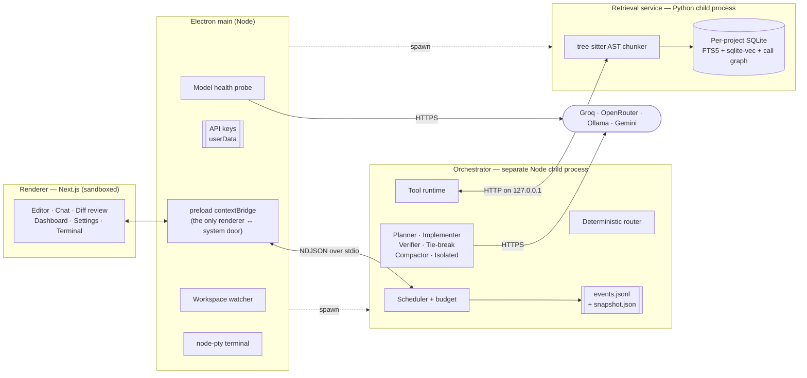
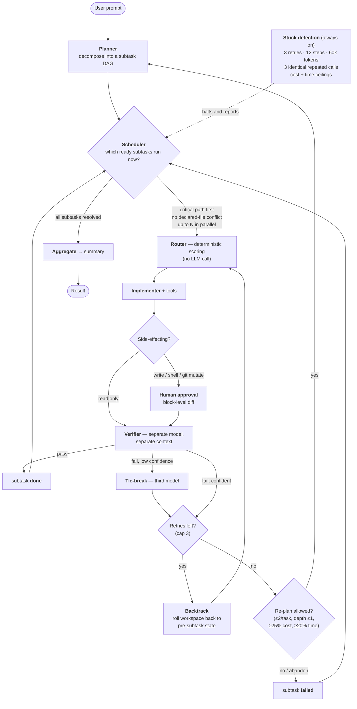
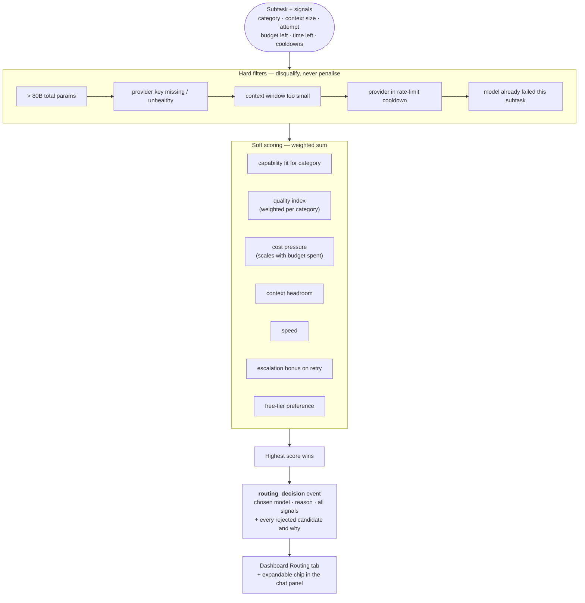
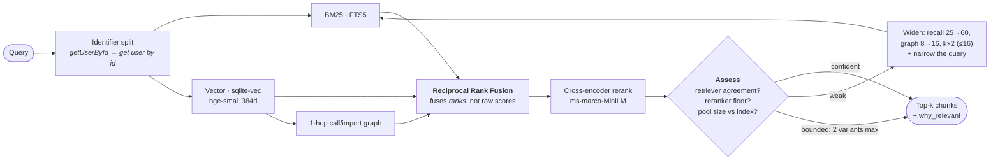

# CodéNawabs

CodéNawabs is an agentic coding IDE built for the Takneek PS (IIT Kanpur Programming Club). It is an Electron + Next.js shell around a standalone multi-agent orchestrator that plans, routes, executes, verifies, backtracks and re-plans coding subtasks against a curated roster of **≤80B-parameter** models — with a live observability dashboard, block-level diff review, and crash-safe resume.

The design premise, taken from the PS: no single small open-weight model can carry a hard multi-step coding task. So nothing here assumes one can. Every part of the system is built around the limits of a 27B model rather than around the capabilities of a frontier one.

---

## Documentation map

| If you want to… | Read |
|---|---|
| Get it running on a clean Linux box | [2. Setup from scratch on Linux](#2-setup-from-scratch-on-linux) |
| Understand the system in one picture | [3. Architecture](#3-architecture) |
| Follow a task from prompt to result | [4. The orchestration pipeline](#4-the-orchestration-pipeline) |
| Know how a model gets chosen | [5. Smart routing](#5-smart-routing) |
| Know how code is found | [6. Code retrieval](#6-code-retrieval) |
| Know how agents call tools | [7. Tool calling](#7-tool-calling) |
| Know why every limit is the number it is | [8. Bounds, budgets, and the score they defend](#8-bounds-budgets-and-the-score-they-defend) |
| See what we chose and what we rejected | [15. Trade-offs and rejected alternatives](#15-trade-offs-and-rejected-alternatives) |
| See what actually went wrong while building | [16. Challenges and solutions](#16-challenges-and-solutions) |
| Run a local model | [docs/local-models.md](docs/local-models.md) |

**Contents:** [1. Quick start](#1-quick-start) · [2. Setup on Linux](#2-setup-from-scratch-on-linux) · [3. Architecture](#3-architecture) · [4. Orchestration](#4-the-orchestration-pipeline) · [5. Routing](#5-smart-routing) · [6. Retrieval](#6-code-retrieval) · [7. Tool calling](#7-tool-calling) · [8. Bounds & scoring](#8-bounds-budgets-and-the-score-they-defend) · [9. Model roster](#9-model-roster-and-eligibility) · [10. Settings](#10-settings) · [11. Context control](#11-manual-context-control) · [12. Diff review](#12-diff-review) · [13. Dashboard](#13-observability-dashboard) · [14. Persistence](#14-persistence-and-resume) · [15. Trade-offs](#15-trade-offs-and-rejected-alternatives) · [16. Challenges](#16-challenges-and-solutions) · [17. Testing](#17-testing) · [18. Builds](#18-building-desktop-installers) · [19. Limitations](#19-known-limitations) · [20. Repo map](#20-repo-map)

---

## 1. Quick start

Already have Node 20+, Python 3.10+ and the repo cloned:

```bash
npm install
python3 -m venv retrieval-service/.venv
retrieval-service/.venv/bin/pip install -r retrieval-service/requirements.txt
npm run dev
```

The app finds `retrieval-service/.venv` on its own — no environment variable needed. Then open **Settings** and paste at least one provider key (§2.4). For a clean machine, or if any of that failed, follow §2 in order.

---

## 2. Setup from scratch on Linux

Written for someone who has never seen this codebase, on a fresh Ubuntu/Debian or Fedora install. Every step says what it is for, so a failure is diagnosable rather than mysterious.

### 2.1 System prerequisites

```bash
# Debian / Ubuntu
sudo apt update
sudo apt install -y git curl build-essential python3 python3-venv python3-pip

# Fedora
sudo dnf install -y git curl @development-tools python3 python3-virtualenv python3-pip
```

`build-essential` / `@development-tools` is not optional: `node-pty` (the integrated terminal) is a native module and is compiled during `npm install`.

**Node 20 or newer.** Check with `node -v`. If your distro ships something older, install via [nvm](https://github.com/nvm-sh/nvm):

```bash
curl -o- https://raw.githubusercontent.com/nvm-sh/nvm/v0.40.1/install.sh | bash
exec "$SHELL"
nvm install 20 && nvm use 20
```

**Python 3.10 or newer.** Check with `python3 -V`. Needed for the retrieval service.

**Electron on Linux needs a display.** Over SSH, either use X11 forwarding (`ssh -X`) or run under `xvfb-run`. On a headless CI box, `npm run dev` will start Next.js and then fail to open a window — that is expected, not a broken install.

### 2.2 Clone and install

```bash
git clone <your-repo-url>
cd Agent-Zero-Takneek/next-electron-ide
npm install
```

`npm install` also runs `electron-builder install-app-deps`, which rebuilds `node-pty` against Electron's own Node ABI. If it fails, you are missing a compiler — go back to §2.1.

### 2.3 The Python retrieval service

The IDE runs a small local HTTP service that indexes and searches your codebase. **It is optional but heavily degraded without its dependencies** — skip this and you get line-window chunks and keyword search only: no AST-aware chunking, no vector search, no reranking.

```bash
python3 -m venv retrieval-service/.venv
retrieval-service/.venv/bin/pip install -r retrieval-service/requirements.txt
```

This pulls `tree-sitter` + per-language grammars, `fastembed` (ONNX, ~120MB of models on first use — no PyTorch), `sqlite-vec` and `pathspec`. See [retrieval-service/requirements.txt](retrieval-service/requirements.txt), which documents why each one was picked.

**The app finds this virtualenv automatically.** Interpreter resolution ([`electron/python-interpreter.ts`](electron/python-interpreter.ts)) tries, in order: `$NEXIDE_PYTHON` if you set it, then `retrieval-service/.venv`, then an activated `$VIRTUAL_ENV`, then bare `python3` on `PATH`. So creating the venv at that path is all you need — no environment variable, no shell-rc edit.

Only set `NEXIDE_PYTHON` if your interpreter lives somewhere else:

```bash
export NEXIDE_PYTHON=/path/to/your/python
```

**Confirming it worked.** On startup the Electron log prints the interpreter it chose and `full pipeline available`, or `DEGRADED — missing: …` if that interpreter lacks the packages. The status bar shows `Index ready (… )` normally, or `Index ready (… ) · keyword-only` in amber when degraded. If you see degraded, the venv either was not created at `retrieval-service/.venv` or the `pip install` did not finish.

Verify the service independently of the IDE:

```bash
retrieval-service/.venv/bin/python retrieval-service/verify.py .
```

### 2.4 API keys, per provider

Launch the app (`npm run dev`), open **Settings**, and paste keys for whichever providers you want. Keys are stored locally in Electron's `userData` directory; they are never committed, bundled, or sent anywhere except that provider's own API. A model is only offered to the router once its provider has a working key — the health pill next to each model tells you which.

| Provider | Env var | Where to get it | Cost | Notes |
|---|---|---|---|---|
| **Groq** | `GROQ_API_KEY` | [console.groq.com/keys](https://console.groq.com/keys) — sign in, *Create API Key*, copy the `gsk_…` value | Free tier | Fastest provider; the default for most subtasks. Free tier is rate-limited per minute, which the router handles by cooling the provider down and failing over. |
| **OpenRouter** | `OPENROUTER_API_KEY` | [openrouter.ai/keys](https://openrouter.ai/keys) — sign in, *Create Key*, copy the `sk-or-…` value | Free routes + PAYG | Serves the free-tier models in the roster and acts as Groq's failover target. No card needed for the `:free` routes. |
| **Ollama** | *(none)* | Install from [ollama.com/download](https://ollama.com/download), then `ollama serve` | $0 | Local models, zero marginal cost. See §2.5 and [docs/local-models.md](docs/local-models.md). |
| **Gemini** *(optional)* | `GEMINI_API_KEY` | [aistudio.google.com/apikey](https://aistudio.google.com/apikey) | Free tier | Optional extra route. This is the one entry `npm run verify:models` cannot verify without a key. |

Optional overrides, only if you are proxying a provider: `GROQ_BASE_URL`, `OPENROUTER_BASE_URL`, `GEMINI_BASE_URL`, `OLLAMA_BASE_URL` (default `http://127.0.0.1:11434`).

> **The settings screen is mandatory per the PS** — it exists so evaluators can paste their own keys without touching the code. Nothing in this repo hardcodes a key or reads one from a checked-in file.

### 2.5 Optional — local models with Ollama

```bash
curl -fsSL https://ollama.com/install.sh | sh
ollama serve &                     # leave running
ollama pull qwen2.5-coder:7b       # ~4.7GB, fits 8GB VRAM
```

The roster's Ollama entries appear as `working` in Settings once the server is reachable and the model is pulled. [docs/local-models.md](docs/local-models.md) covers which model fits which machine, why tool-calling support is the deciding factor, and why the local context windows are deliberately small.

### 2.6 Verify the whole install

```bash
npm run typecheck     # all three tsconfigs, no emit
npm test              # full suite, ~1 min
npm run verify:models # checks every registry entry against live provider catalogues
npm run dev           # launches the IDE
```

If `npm test` is green and `npm run dev` opens a window, the install is good. In the `npm run dev` output, look for `[retrieval] python interpreter: …/retrieval-service/.venv/bin/python` and `full pipeline available` — if it says `DEGRADED` instead, revisit §2.3.

---
## 3. Architecture

### 3.1 Process topology

Four processes, three trust boundaries. Nothing in the renderer can touch the filesystem, a provider key, or a model directly.



### 3.2 Why these boundaries

**Why the orchestrator is a separate process, not a module in Electron's main process.** An agent loop is unbounded work: a runaway tool call, a 60-second provider timeout, a JSON parse over a 200KB response. Running that on the main process blocks the UI thread, and a frozen IDE during a judged demo is indistinguishable from a crash. As a child process it can spin, hang or die without the window noticing. It is spawned via `process.execPath` with `ELECTRON_RUN_AS_NODE=1`, so the end user needs no separate Node install. The cost is one extra IPC hop per event, which is nothing against a model call.

**Why the retrieval service is Python, and separate again.** The whole retrieval stack that matters — `tree-sitter` grammars, `fastembed`, `sqlite-vec` — is Python-first. Reimplementing AST chunking in Node meant either a worse chunker or shipping a second native toolchain. Keeping it out-of-process also means a segfault in a native grammar takes down a restartable helper, not the IDE.

**Why two different transports.** The orchestrator channel is long-lived and *stream-shaped*: it emits hundreds of ordered events per task. NDJSON over stdio gives ordering for free (the pipe guarantees it), needs no port allocation or firewall prompt, and makes the watchdog trivially correct — EOF on stdout means the orchestrator is gone, full stop. An HTTP client cannot distinguish "crashed" from "slow" without inventing timeouts. The retrieval service is the opposite shape — request/response, no streaming — so plain HTTP on a loopback port is the simpler fit. Different problem, different transport.

**Why the renderer never sees a key.** `contextBridge` exposes a fixed method list (`src/lib/electron-api.ts`) and nothing else; `nodeIntegration` is off. Provider calls happen in the orchestrator, health probes in main. A renderer `fetch` to a provider would also be CORS-blocked anyway — but the real reason is that a rendered page should never hold a credential.

### 3.3 The wire protocol

Newline-delimited JSON, one object per line, defined in [`orchestrator/protocol.ts`](orchestrator/protocol.ts). Two families share the channel, distinguished by `kind`:

- **Command** (main → orchestrator): `start_task`, `resume_task`, `cancel_task`, `approval_response`, `isolated_query`, `revert_latest`, `ping`. Carries an `id`; answered by a `reply`.
- **Event** (orchestrator → main → renderer): everything the dashboard renders.

Every event carries `taskId`, a monotonic `seq`, and `ts`. `seq` lets the renderer detect a dropped or reordered frame instead of silently rendering a hole; `ts` is the orchestrator's own clock, so a replayed trace shows *real* timing rather than render timing.

---

## 4. The orchestration pipeline

Every task follows the same path, checkpointed after each step so it can be killed and resumed without losing progress.



**decompose → route → execute → verify → backtrack → re-plan → aggregate**

### 4.1 Decompose

A planning-tier model turns the prompt into 1–6 subtasks with explicit dependencies, a category (`analysis` / `codegen` / `simple_edit` / `verification`) and a declared list of files each expects to modify.

Three rules in the planner prompt exist purely to make the plan *cheap to execute*, and each was a measured problem first:

- **`dependsOn` defaults to empty.** A dependency is a cost, not documentation — it serialises two subtasks that could have run at once. The prompt makes the planner justify each edge ("would this fail if the other had not run?") rather than listing them out of tidiness.
- **`touchesFiles` is declared.** Two parallel subtasks editing one file is not a correctness problem (the stale-write guard catches it) but it *is* a cost problem: the loser's proposal is refused and it must re-read and re-propose — a whole wasted round-trip. Declaring files lets the scheduler avoid the collision, which is what makes aggressive independence safe to declare.
- **No trailing "verify everything" subtask.** Every subtask is already checked by a separate verifier the moment it finishes. A final verification step that depends on all the others is a duplicate check *and* a barrier that forces every parallel branch to finish before it can start.

If the request is genuinely one-shot, the planner returns a single subtask with `trivial: true` — the system does not manufacture steps to look busy.

### 4.2 Route

Deterministic scoring, not another model call. See §5.

### 4.3 Execute

The assigned model runs with tool access, under three independent per-subtask caps — **3 retries, 12 steps, 60k tokens** — plus a guard that aborts after **3 identical repeated tool calls**. Each cap answers a different runaway: a task that keeps failing, one that keeps working without converging, and one that loops on the same call. Every cap firing is surfaced as an `intervention` event, never a silent stop. The exact values and the reasoning behind each are in [§8.3](#83-every-limit-in-one-table).

### 4.4 Verify

A separate verification-tier model, in its own context, checks the subtask's output against its stated goal. It is shown only the files *its own subtask* changed — under parallelism the global changed-set would invite it to fail work it was never asked to judge. When the verifier fails a subtask with low confidence, a third model breaks the tie rather than one model's bad day ending the subtask.

### 4.5 Backtrack

A failed verification **rolls the workspace back** to its state before the subtask ran, *then* re-queues it with the verifier's reason fed into the conversation.

The rollback is the part that matters. Without it, attempt 2 starts from a tree the verifier already rejected and attempt 3 compounds it — and when retries run out, the union of every broken attempt is left on disk under a `failed` subtask whose dependents are blocked, so nothing downstream ever cleans up.

The undo point is captured lazily: the first time a subtask writes to a file, that file's prior content is stashed (creating a file records "did not exist", so undoing it is a delete). Restoring costs one write per touched file and needs no VCS — deliberately **not** `git stash` / `git checkout .`, because the project root is not guaranteed to be a repo, and an agent reaching into your index or stash to undo its own mistake is a far worse failure mode than the one it is fixing.

Rollback fires on all four terminal failures: verification failed with retries left, retries exhausted, the agent reported `BLOCKED`, and no model available. It never fires on a pass — verified work drops its undo point immediately, so no later failure can reach back and revert a subtask that succeeded. Because a rollback can undo edits **you approved by hand**, it is always reported as a `workspace_restored` intervention naming every file, and the retry prompt explicitly tells the model its edits were reverted (otherwise it assumes they survived and writes half a fix).

Undo points are **per subtask**: rolling back one must not revert a parallel sibling's approved edits.

### 4.6 Re-plan, bounded

When a subtask has spent *every* retry, the system stops retrying and changes the plan instead.

The retry ladder has already re-run that subtask on a stronger model with the verifier's complaint fed back in. If three of those failed, the model is not the problem — **the subtask is**, and a fourth retry is precisely the "blindly retrying the same action" the PS penalises. So a re-planner is asked to *diagnose* the failure and either decompose the subtask into 2–3 genuinely different steps, or say it is impossible. `abandon` is a first-class answer: a re-planner that always produces a new decomposition is one that spends the remaining budget rewording the same impossible subtask.

The replaced subtask becomes `replaced` — a status distinct from `failed` on purpose, because the work is still being attempted under new ids, and counting it as incomplete would make a *successful* re-plan report failure. Anything that depended on it is rewired to the last replacement; without that rewire the dependents wait forever on an id that can never be `done`.

**Every bound is a hard stop, checked before the planner call so a disallowed re-plan costs nothing** (consolidated with every other limit in [§8.3](#83-every-limit-in-one-table)):

| Bound | Value | Why |
|---|---|---|
| Re-plans per task | 2 | Whole-task budget, not per-subtask — stops a struggling task rewriting its own plan indefinitely |
| Re-plan depth | 1 | Only original subtasks may be re-planned. A replacement that fails is simply failed — no recursive tree of re-plans |
| Replacements per re-plan | 3 | Caps how far one re-plan can widen the DAG |
| Cost remaining | ≥25% | A re-plan buys a planner call **plus** a fresh round of subtask work |
| Time remaining | ≥20% | Same |

The budget gates use `fractionRemaining`, not `canAfford` — `canAfford` answers "can I pay for this one call", which is the wrong question for a decision that commits to a whole extra round of work. Starting a re-plan at 90% spent reliably converts a partial result into a **ceiling breach, which scores zero** — strictly worse than accepting one failed subtask. Every refusal emits a `replan_declined` intervention naming which bound stopped it.

### 4.7 Aggregate

Once every subtask has resolved to `done`, `failed`, `skipped` or `replaced`, results are summarised back to the user. A task ends `done` only if **every** subtask ended `done` — any `failed` (retries exhausted) or `skipped` (its dependency failed) makes the whole task `failed`, with the specific subtasks and reasons named. A partially-successful run is never reported as a plain success.

### 4.8 Parallel subtasks

Subtasks whose dependencies are satisfied run concurrently, up to the limit in Settings (default 3; `1` is strictly sequential and is the escape hatch if parallelism ever misbehaves in front of a judge). The dependency graph is unchanged — the only difference is that more than one *ready* subtask may be in flight.

**Which ready subtask goes first is not arbitrary.** Ready subtasks are ordered by how much work hangs off them (1 + the longest chain of dependents). With 3 slots and 5 ready subtasks, plan order would happily start three leaves while the one subtask that unblocks the other half of the plan waits — and total time is set by the critical path. This is ordinary list scheduling; it changes only *which* ready subtask runs first, never *whether* one may run.

**Which two may run together is also not arbitrary.** Two subtasks whose declared `touchesFiles` overlap are never co-scheduled. Deferring costs nothing — the subtask takes the next free slot — and it avoids a guaranteed wasted round-trip. With nothing running there is nothing to conflict with, so this can never deadlock.

Four things had to be made concurrency-safe first, each a real failure mode rather than a hypothetical:

- **Approvals are serialised.** The review pane holds exactly one pending diff, so a second concurrent approval request would replace the first in the UI — and the first, which an agent is blocked on, would never resolve. That is a permanent hang. One approval is outstanding at a time, task-wide.
- **Every write re-checks the file.** A diff is computed against the file as it was when the agent proposed it. If the bytes moved since — a parallel subtask's approved edit, or you typing in the editor while the review sat open — the write is refused and the agent is told to re-read and re-propose. Serialising the prompt is not enough to prevent a lost update; only comparing against what was actually read is.
- **Undo points are per subtask**, so a rollback cannot revert a sibling's approved edits.
- **Changed-file sets are per subtask**, so a verifier only judges its own subtask's work.

Concurrency drops back to one automatically once spending passes **75% of the cost ceiling** (`PARALLEL_BUDGET_FLOOR`, [§8.3](#83-every-limit-in-one-table)): concurrent dispatches can each pass the affordability check and still breach together, and a breach scores zero.

### 4.9 Compaction

At **70%** of the active model's real context window, older turns are summarised; at **88%**, compaction is forced (thresholds and the `KEEP_RECENT` window explained in [§8.3](#83-every-limit-in-one-table)). Anything marked a pinned fact — the restated goal, `AGENTS.md` rules, user-pinned context — is re-injected **verbatim** after compaction rather than re-summarised, so constraints and decisions from earlier in the task do not drift. Compaction is emitted as an event with before/after token counts and the list of preserved facts, so the dashboard shows exactly what was dropped.

---
## 5. Smart routing

Every subtask is assigned a model by **deterministic scoring in `orchestrator/router.ts`** — no LLM call. Routing with a model would put a model call in front of every model call, on the cost term the PS weights ~2× time, and would make the same subtask route differently on two runs, which destroys reproducibility of the trace.



**Hard filters disqualify; they never merely penalise.** A model over 80B is not "expensive", it is *ineligible* — the PS makes it disqualifying, so it can never be outweighed by being cheap or fast.

**Failover preserves progress.** If a call fails or a rate limit is hit, the provider goes into cooldown, the failed model is excluded from this subtask's candidate set, and the subtask is re-routed to the next best model **with its conversation intact** — the subtask is not restarted and nothing already approved is undone. This is emitted as a `provider_failover` intervention so a failover is visible rather than looking like an unexplained model change.

**The routing decision is never hidden.** One `routing_decision` event feeds two views: the dashboard's per-node **Routing** tab, and an expandable row in the agent panel itself. The panel row is a one-liner by default (`⇄ north-mini-code · fits codegen, zero marginal cost · 3 not picked`); clicking it drops down the full reason, the decision signals, and every candidate that lost with the reason it lost (`llama-3.3-70b — scored 41.3 vs 58.7`, `gemma-4-31b — context ~60000 tok exceeds its 262144 window`).

**Why the quality index is weighted per category.** The cost of being wrong is not flat. A bad `simple_edit` is caught on the next line; a bad *plan* is only caught after every subtask under it has been paid for; a bad *verification verdict* is never caught at all — it ships. So `analysis` (which is how the planner and tie-break both route) and `verification` weight quality ~4× harder than `simple_edit` does. Cost still dominates overall — the cost penalty reaches 45 against quality's ~23 — so a free model that fits still wins early in a task, which is correct when C is weighted ~2× T in `S_task`. Quality decides between models of *similar* price, and decides the tie-break outright.

Every scoring weight, the per-category quality table, and the `S_task` arithmetic that motivates them are laid out in [§8.2](#82-the-scoring-function-worked-through) and [§8.3](#83-every-limit-in-one-table).

---

## 6. Code retrieval

Each project gets its own SQLite index keyed by `sha256(absolute path)[:16]`, so **retrieval and agent memory cannot leak between projects** — isolation is "which file are we opening", not "which server are we trusting".



Indexing chunks on **AST boundaries** (tree-sitter): one chunk per function/class/method with its signature, docstring and body kept together — never a fixed-token window that starts mid-function.

### 6.1 Making natural language match identifiers

SQLite's FTS5 tokeniser treats `computeDelinquencyGraceWindow` as **one atomic token**. So "delinquency grace window" — or any natural-language phrasing — could never match it through BM25, no matter how the query was worded, because the *indexed* form was atomic. Verified directly:

```
FTS5 MATCH 'computeDelinquencyGraceWindow'  -> 1 hit
FTS5 MATCH 'delinquency'                    -> 0 hits
```

So at index time every identifier in a chunk's symbol and code is **also** stored split into sub-words, in a dedicated `tokens` FTS column (`identifiers.py`). Raw code is still indexed verbatim, so exact-identifier search is unchanged; the split column is pure additional recall. The same split runs on the query.

**Why not a custom FTS5 tokeniser** — the "correct" answer, and it needs a C extension compiled per platform: exactly the dependency this service was built to avoid (it is why `sqlite-vec` was chosen over a standalone vector DB). A pre-split column is pure Python, costs one pass per chunk at index time, and is inspectable in any DB browser.

This is a schema change, so the index carries an `INDEX_FORMAT_VERSION` in `PRAGMA user_version`. An index written by an older format is dropped and rebuilt from source rather than migrated in place — rebuilding is fast and cannot leave a half-migrated file.

### 6.2 Detecting and recovering from a weak retrieval

Detection uses signals that are each independently interpretable — **deliberately not the `score` field**, which is an RRF *rank* score whose maximum here is ≈0.074 and whose absolute value carries no semantic meaning. Thresholding on it would look like a confidence measure and be numerology.

The anchor signal is **retriever agreement**. BM25 and vector search are independent — different representation, different algorithm — so a chunk both rank highly is corroborated by two methods that fail differently. Agreement requires a **majority** of the top results, not one: a single lexical coincidence is not evidence.

The cross-encoder gets two thresholds, not one, because its usable range on code is not its nominal range. Measured against this project's own `orchestrator/` (161 chunks):

| | top reranker score | agreement (of top 3) |
|---|---|---|
| Answerable queries (6) | **−4.1 … +4.5** | 3/3 every time |
| Absent queries (5) | **−11.2 … −9.0** | 0–1/3 |

There is a wide empty band between ≈−9 and ≈−4 separating "the model is grumpy about code" from "nothing here is on topic". Both thresholds sit inside it:

| Signal | With agreement | Without agreement |
|---|---|---|
| Reranker below **−8** (`RERANK_IRRELEVANT_BELOW`) | **decisive** | **decisive** |
| Reranker below **−6** (`RERANK_WEAK_BELOW`) | contributing | **decisive** |
| Candidate pool thin *relative to index size* | contributing | **decisive** |
| Most results graph-expansion only | contributing | contributing |
| Fewer results than requested | contributing | contributing |

Three of these came out of testing against a real index and would have been wrong otherwise — see §16.

Current accuracy on the real orchestrator source: **10/10 answerable queries not flagged, 5/5 unanswerable queries flagged**. That check runs in `test_recovery_e2e.py` so a regression in the thresholds fails a test rather than quietly degrading.

**Why not ask a model to rewrite the query.** It puts a model round-trip inside the most-called tool in the system, on the cost term weighted ~2× time. The deterministic path costs nothing, has no latency variance, and is *reproducible* — the same weak query always escalates identically, which a rewrite model could not guarantee and which would make the dashboard trace unrepeatable. If it still comes back weak the tool hands the problem **up** to the agent, which is already a model in a loop and can rephrase semantically — paid for by a call we were making anyway.

Three properties that could have gone wrong:

- **Escalating can never return a worse set.** The best attempt wins on confidence; if widening surfaces only noise, the original results are returned and the low confidence reported honestly.
- **Bounded** — at most `MAX_VARIANTS_TRIED` (2) retries, exiting at the first that clears the bar.
- **Never silent** — every attempt (query, k, confidence, reasons) is recorded in `attempts` and surfaced as a `retrieval_weak` intervention. A result that *stays* weak reaches the agent with a `[retrieval confidence 0.15 — LOW]` header naming the queries already tried, so its next move is genuinely different. Silently returning low-confidence snippets is how an agent ends up confidently editing the wrong file.

---

## 7. Tool calling

### 7.1 The format, and why

Tools are declared as **JSON Schema** and invoked through the provider's native **OpenAI-compatible `tools` / `tool_calls`** field — not a hand-rolled text protocol like `ACTION: read_file("x")` parsed out of prose.

That choice is not cosmetic. Every provider in the roster (Groq, OpenRouter, and Ollama's `/api/chat`) speaks the OpenAI tool-calling shape, so one adapter serves all three and adding a provider is a base-URL change rather than a new parser. More importantly, the *model* has been fine-tuned to emit that shape: a hand-rolled format asks a 27B model to be reliable at something it was never trained on, and small models are exactly where a fragile format breaks first. Schema-validated arguments also fail *loudly* — a malformed call is a parse error we can feed back, not a plausible-looking string that silently reads the wrong path.

The one place we constrain the schema harder than the obvious design: the `git` tool takes `args` as an **array of strings**, never one command line. A single string would have to be shell-split somewhere, and shell-splitting attacker- or model-controlled text is how argument injection happens. An array goes straight to `execFile` with no shell.

### 7.2 The tools

| Tool | Side-effecting | Notes |
|---|---|---|
| `retrieve_context` | no | The primary way to see code. Returns ranked chunks with a confidence header, never whole files. |
| `read_file` | no | Explicit read, honours `.nexideignore`. |
| `list_dir` | no | Honours `.nexideignore`. |
| `git` | no | Read-only subcommands only: `status`, `log`, `diff`, `show`, `branch`, `blame`, `ls-files`, `rev-parse`. Anything state-changing is refused with a pointer to `run_command`. |
| `web_search` | no | DuckDuckGo Lite, HTML stripped to text. For current docs, API signatures, compiler errors. No key required. |
| `propose_edit` | **yes** | The only write path the orchestrator controls. Always goes to block-level human review. |
| `run_command` | **yes** | Arbitrary shell, always approval-gated. This is also how state-changing git (`commit`, `branch`, `merge`) runs. |

### 7.3 The approval gate

**Nothing with a side effect executes without human approval.** `propose_edit` renders a real unified diff for block-level accept/reject; `run_command` renders the exact command as a single yes/no. Read-only tools run freely — gating them would make the agent unusable without making it safer.

Two consequences worth stating because they are easy to get wrong:

- **Partial approval is a first-class outcome, not a failure.** When you accept some hunks and reject others, the tool result tells the agent *exactly what landed on disk*, and it continues from that reality — working around the rejected parts rather than assuming its whole edit applied.
- **State-changing git deliberately has no fast path.** It would have been easy to let the `git` tool commit directly. Routing it through `run_command` means a commit gets the same explicit approval as any other side effect, and there is exactly one gate to audit instead of two.

---
## 8. Bounds, budgets, and the score they defend

Every cap in this system is a **score-defence mechanism**, not a safety nicety. This section is the single place that lists all of them, works through the scoring function they serve, and answers the Q&A question each one invites: *why that number and not half or double it?*

### 8.1 Why a coding agent has to be bounded at all

An agent loop is unbounded work by construction: each turn can spawn another tool call, another model round-trip, another 200KB response to parse. The PS scoring makes unbounded work **catastrophic, not merely slow**:

- Exceeding **$0.50 or 2700 s** on an eval task forces **A = 0** — "regardless of partial progress". A 95%-correct solution that costs $0.51 scores exactly zero.
- Short of that ceiling, the `S_task` denominator is raised to **ε = 2.5**, so cost and time overruns are punished *super-linearly* — the closer to the ceiling, the harder each extra cent and second is penalised (worked example in §8.2).

So the design treats "stop the agent in time" as a first-class correctness property. There are **four distinct runaway modes**, and no single cap catches more than one of them:

| Runaway mode | What it looks like | Caught by |
|---|---|---|
| **Thrash** — keeps failing the same subtask | attempt 4, 5, 6… on one subtask | `MAX_RETRIES_PER_SUBTASK = 3`, then bounded re-plan, then `abandon` |
| **Wander** — works forever without converging | 20 tool calls, no final answer, context ballooning | `MAX_STEPS_PER_SUBTASK = 12`, `MAX_TOKENS_PER_SUBTASK = 60 000` |
| **Loop** — repeats one identical action | `read_file("x")` with the same args, turn after turn | `MAX_IDENTICAL_REPEATS = 3` |
| **Overrun** — eats the task-level ceiling | $0.48 spent, another paid call queued | pre-dispatch budget gate + reserve margins + parallel drop-back |

Every cap that fires emits an **`intervention` event** with the cause and the action taken — it is never a silent stop. A cap that halts the agent without telling the dashboard why is indistinguishable from a crash in front of a judge.

### 8.2 The scoring function, worked through

From the PS:

```
                 10 · A
S_task = ────────────────────────────────────────────
         ( 1 + w_C·(C / C_base) + w_T·(T / T_base) ) ^ ε

A = passedTests / totalTests        w_C = 0.65    C_base = $0.15    ε = 2.5
C = total $ across all agent calls  w_T = 0.35    T_base = 1320 s
T = wall-clock seconds              Hard ceilings: C ≤ $0.50, T ≤ 2700 s, else A := 0
```

`C_base` and `T_base` are **baselines, not targets** — the formula keeps scoring above them, just steeply less. Four runs of the same hypothetical task, using the PS constants:

| Run | A | C | T | C/C_base | T/T_base | denominator | **S_task** |
|---|---|---|---|---|---|---|---|
| **Frugal** — local + free-tier heavy | 0.80 | $0.02 | 1100 s | 0.13 | 0.83 | 1.38 ^2.5 ≈ 2.23 | **3.58** |
| **Balanced** — paid only where it pays | 0.90 | $0.08 | 900 s | 0.53 | 0.68 | 1.59 ^2.5 ≈ 3.17 | **2.84** |
| **Ceiling-hugger** — best model every call | 0.90 | $0.42 | 2400 s | 2.80 | 1.82 | 3.46 ^2.5 ≈ 22.2 | **0.41** |
| **One retry too many** at 98 % budget | ~~0.90~~ **0** | $0.51 | 2400 s | — | — | — | **0.00** |

What the architecture is built around, read straight off that table:

- **Same accuracy, 7× the score** between "balanced" and "ceiling-hugger". Accuracy is necessary, but the multiplier decides the round. This is why routing is cost-first.
- **Lower accuracy can still win outright.** "Frugal" scores highest *despite the worst A*, because ε = 2.5 turns a 4× cost cut into a denominator cut big enough to outweigh a missed test. This is the explicit justification for: the router's cost penalty (max **45**) outweighing its quality bonus (max ~**23**); local models being first-class rather than a fallback; and free-tier *exhaustion*, not model quality, being what pushes routing onto paid tiers.
- **Cost is ~1.9× time.** `w_C / w_T = 1.86`. The router spends its light "speed" points only to break ties; it spends real points on the cost term.
- **The cliff is absolute and close.** The last row is not hypothetical — it is the single most important failure mode in the system. One unaffordable retry near the ceiling converts a top-quartile score into a zero. Every budget guard in §8.3 exists to make that transition *impossible*, not merely unlikely: cost is estimated **before** dispatch in two independent places, a 12 % / 10 % reserve is held that the agent may never spend, concurrency drops to 1 at 75 % spent, and a re-plan will not start below 25 % remaining.

> **Defending this in Q&A:** the honest one-liner is *"we optimise the denominator, because with ε = 2.5 the denominator is where the score is."* Accuracy gets us onto the board; cost efficiency is what ranks us on it.

### 8.3 Every limit in one table

Grouped by subsystem. The **"chosen against"** column is the failure the current value is picked to avoid — i.e. the answer to *"why not 2? why not 20?"*

#### Orchestration — per subtask · `orchestrator/orchestrator.ts`

| Constant | Value | Bounds | Chosen against |
|---|---|---|---|
| `MAX_RETRIES_PER_SUBTASK` | **3** | attempts on one subtask before it re-plans or fails | Attempt 1 is the routed model; 2–3 escalate to a stronger model *with the verifier's complaint fed back in*. Three genuinely different attempts is enough evidence that the **subtask** is wrong, not the model. A 4th is the "blindly retrying the same action" the PS explicitly penalises. |
| `MAX_STEPS_PER_SUBTASK` | **12** | tool-calling turns before a forced stop | A real subtask — retrieve → read 2–3 files → edit → self-check — runs 5–8 steps. 12 is comfortable headroom. 20+ is a model that has lost the thread and is now just burning the time ceiling. |
| `MAX_TOKENS_PER_SUBTASK` | **60 000** | cumulative tokens spent on one subtask | ≈ 45 % of a 131k window. Past this the subtask is accreting context it will never use, and input tokens are re-billed on *every* remaining turn — cheaper to stop and re-plan than to keep paying. |
| `MAX_IDENTICAL_REPEATS` | **3** | identical consecutive tool calls with identical arguments | 2 can be a legitimate re-read of a file right after editing it. 3 in a row carries no new information and is a loop. |

#### Orchestration — re-planning · `orchestrator/orchestrator.ts`

All five are **hard stops checked before the planner call**, so a disallowed re-plan costs nothing. Re-planning is the only mechanism that can *add* work to a task already going badly, hence no heuristics here.

| Constant | Value | Chosen against |
|---|---|---|
| `MAX_REPLANS_PER_TASK` | **2** | Whole-task budget, not per-subtask. Stops a struggling task from rewriting its own plan indefinitely. |
| `MAX_REPLAN_DEPTH` | **1** | Only original (depth-0) subtasks may re-plan. A replacement that fails is simply failed — no recursive tree of re-plans off re-plans. |
| `MAX_REPLACEMENTS_PER_REPLAN` | **3** | Caps how far a single re-plan can widen the DAG. |
| `REPLAN_MIN_COST_FRACTION` | **0.25** | A re-plan buys a planner call **plus** a fresh round of subtask execution. Starting one at 90 % spent reliably converts a partial result into a **ceiling breach, which scores zero** — strictly worse than accepting one failed subtask. Gated on `fractionRemaining`, not `canAfford`, because `canAfford` only answers "can I pay for the next single call". |
| `REPLAN_MIN_TIME_FRACTION` | **0.20** | Same logic, against the 2700 s ceiling. |

Worst-case work this bounds: `2 re-plans × (1 planner call + 3 subtasks × 3 retries × 12 steps)` — and the budget/time gates cut it off well before that ceiling in practice.

#### Budget ceilings · `orchestrator/budget.ts`

| Constant | Value | Chosen against |
|---|---|---|
| `maxCostUsd` / `maxSeconds` | **$0.50 / 2700 s** | Defaults set to the PS hard ceilings exactly. Both are surfaced in Settings; the only sensible adjustment is *downward*, to buy an extra safety margin against a token-estimate error on the hidden eval set. The `RESERVE` fractions below already hold back 12% / 10% on top of whatever is configured here. |
| `COST_RESERVE` | **0.12** | The agent may spend at most **88 %** of the cost ceiling. The remaining 12 % covers the final summary call and absorbs a ~5 % error in the pre-call token estimate. Running to exactly $0.50 and *then* finding the estimate was 5 % low is the exact failure this removes. |
| `TIME_RESERVE` | **0.10** | Same, for wall-clock time — a slightly smaller margin because time estimates drift less than token counts. |
| `PARALLEL_BUDGET_FLOOR` | **0.25** | Below 25 % cost remaining (i.e. 75 % spent), concurrency drops to 1. Concurrent dispatches can each individually pass the affordability check and still **breach the ceiling together**; serialising removes that race for the dangerous last quarter. |
| `ASSUMED_COMPLETION_TOKENS` | **600** | The completion size the router *and* the pre-dispatch budget gate both assume when costing a call that has not happened yet. Exported from one place so the two gates cannot silently drift apart. |

#### Routing · `orchestrator/router.ts`

The score is `capability fit + context fit + cost pressure + quality + speed tiebreak`, with hard filters (eligibility, context window, health, cooldown, already-failed) applied first.

| Weight | Value | Reasoning |
|---|---|---|
| Capability fit for the subtask category | **+40** if `good_at` includes it, **−25** if not | A model not tuned for the category is a likely retry, and a retry is the most expensive thing on both score terms. |
| Cost penalty (max) | **budgetPressure × 45** | `budgetPressure = min(1, projectedCost / (budgetRemaining × 0.35))` — scales with how tight the *remaining* budget is, so a capable model is affordable early and only cheap models survive near the reserve. 45 is deliberately larger than the max quality contribution. |
| Zero-marginal-cost bonus | **+18** | Local / free-tier routes. Large enough that a free model that fits the category beats a paid one on any normal-sized budget. |
| Quality index, weighted per category | `qualityIndex × QUALITY_WEIGHT` | `QUALITY_WEIGHT` = analysis **0.45**, verification **0.40**, codegen **0.30**, simple_edit **0.10**. The cost of a wrong answer is not flat: a bad `simple_edit` is caught on the next line; a bad *plan* is caught only after every subtask under it is paid for; a bad *verification verdict* is never caught — it ships. The planner and tie-break both route as `analysis`. |
| Capability fallback for unbenchmarked models | `min(30, paramsB × 0.4)` | "Big but unmeasured" is not evidence of quality, so the size-based fallback is capped well below the top of the real index. |
| Context headroom bonus | **+8** if window > 3× the estimated context | Reward *enough* room; do not reward a 131k model on a 2k prompt (that is just wasted money on providers that bill by tier). |
| Escalation bonus on retry | `min(22, capability × 0.38)`, only when `attemptNumber > 1` | After a cheap model failed, bias toward capability over thrift — repeating the cheap failure is the runaway the PS names. |
| Speed tiebreak | fast **+6**, medium **+3**, slow **0** | Time is the lighter term (`w_T` 0.35), so speed only ever breaks a near-tie. |

#### Verification · `orchestrator/orchestrator.ts`

| Threshold | Value | Reasoning |
|---|---|---|
| Tie-break trigger | verifier `confidence < 0.6` | Below this the verifier is not sure enough to end a subtask on its own say-so. One extra call on a third model is far cheaper than a wrongly-failed subtask that then consumes a full retry ladder or a re-plan. |

#### Compaction · `orchestrator/compaction.ts`

Both thresholds are a **fraction of the active model's real context window**, not a fixed message count — a constant would over-compact on a 262k model and overrun a 32k local one.

| Constant | Value | Reasoning |
|---|---|---|
| `SOFT_THRESHOLD` | **0.70** | Compact opportunistically at a message boundary. Keeps the *next* call's input cost down, which matters because input tokens are re-billed every turn. |
| `HARD_THRESHOLD` | **0.88** | Compact now or the next call overflows the window. The 12% gap below 100% leaves room for the reply the model is about to generate plus the pre-call token estimate's error margin — trigger any higher and a compaction can still be followed by an overflow. |
| `KEEP_RECENT` | **6** | The last 6 messages survive verbatim — recent tool results are what the model is actively reasoning about. Pinned facts (goal, `AGENTS.md`, modified paths, decisions) are re-injected verbatim *on top* of that, so they never degrade through repeated summarisation. |

#### Retrieval · `retrieval-service/retrieval.py`

| Constant | Value | Reasoning |
|---|---|---|
| `RECALL_K` | **25** | Candidates pulled from *each* of BM25 and vector search before fusion. Enough for RRF to have signal; small enough that reranking all of them is cheap. |
| `MAX_SNIPPET_LINES` | **60** | Hard cap on the lines of any one returned chunk. An AST chunk is usually a whole function; a 300-line one is truncated with a marker rather than dropped, so a single result cannot dominate the agent's context budget. |
| `GRAPH_EXPAND_TOP_N` | **8** | Only the top 8 fused hits get 1-hop call/import-graph expansion — graph neighbours of a weak hit are noise. |
| `RRF_K` | **60** | The standard constant from the Reciprocal Rank Fusion paper (Cormack et al., 2009). RRF fuses *ranks*, never raw scores — BM25 scores, cosine distances and cross-encoder logits share no scale or zero. |
| `GRAPH_RRF_WEIGHT` | **0.5** | A graph-expansion hit matched a *neighbour* of the query, not the query — it counts half. |
| `RERANK_RRF_WEIGHT` | **2.0** | The cross-encoder is the one genuinely calibrated relevance signal in the pipeline, so its ranking counts double when present. |
| `WIDE_RECALL_K` / `WIDE_GRAPH_EXPAND_TOP_N` | **60 / 16** | What a *single* widened retry widens to — ≈ 2.4× wider. One step, not a ramp: a second pass either finds the thing or it is not in the index. |
| `WIDE_K_MULTIPLIER` / `MAX_WIDE_K` | **2 / 16** | A widened retry may return at most 2× the requested chunks, capped at 16, so "recover from a weak result" never becomes "dump the codebase into context". |
| `MAX_VARIANTS_TRIED` | **2** | Reformulation can produce several identifier spellings; trying all of them on a query that is simply absent from the index is latency for nothing. Exit at the first that clears the bar. |
| `MIN_CANDIDATE_POOL` | **6** | Fewer than 6 distinct chunks matching *anything* signals a recall failure — **but only relative to index size** (`< 50 %` of a tiny index is fine). An absolute floor fired on every query in a small repo; see §16. |
| `WEAK_CONFIDENCE` | **0.5** | Below this the result set is flagged and handed *up* to the agent (already a model in a loop) rather than rewritten by a dedicated model call. |
| `RERANK_WEAK_BELOW` / `RERANK_IRRELEVANT_BELOW` | **−6.0 / −8.0** | Two thresholds, not one, because ms-marco MiniLM was trained on web passages and systematically under-scores code. Measured on this repo's own `orchestrator/` source: answerable queries top out at −4.1…+4.5, absent queries at −11.2…−9.0. Both thresholds sit in the empty band between. |
| `DECISIVE_PENALTY` / `CONTRIBUTING_PENALTY` / `SHORTFALL_PENALTY` | **0.55 / 0.30 / 0.20** | The same signal means different things with vs. without independent-retriever agreement, so penalties are assigned in code by context rather than as one fixed weight per signal (a flat additive scheme left "decisive" signals stuck at 0.6–0.7, never crossing the 0.5 bar — see §16). |

#### Indexing · `retrieval-service/indexer.py`

| Constant | Value | Reasoning |
|---|---|---|
| `MAX_FILE_BYTES` | **1 500 000** | Files above ~1.5 MB are generated bundles, minified vendor code or lockfiles — indexing them buries real code in the results and wastes embedding time. |

#### Planning · `orchestrator/agents.ts`

| Limit | Value | Reasoning |
|---|---|---|
| Subtasks per plan (prompt) | **1–6** | "Fewer, well-scoped subtasks beat many tiny ones" — each subtask carries a full context-assembly and verification cost. A genuinely one-shot request returns a single `trivial: true` subtask; the system never manufactures steps to look busy. |
| Subtasks per plan (parser clamp) | **8** | A defensive ceiling above the prompt's stated max, in case a model over-produces — the parser truncates rather than letting an unbounded DAG through. |

#### Process & infrastructure

| Constant | Value | Location | Reasoning |
|---|---|---|---|
| `REQUEST_TIMEOUT_MS` | **90 000** | `orchestrator/providers.ts` | A model call that has not answered in 90 s is treated as a network failure and failed over to another provider — retryable *elsewhere*, progress intact. `callModel` itself never retries in place; the orchestrator's retry ladder owns that. |
| `MAX_RESTARTS` | **5** | `electron/orchestrator-bridge.ts` | The main process will re-spawn a crashed orchestrator child up to 5 times before giving up and surfacing the failure — enough to ride out a transient crash, not enough to hide a reproducible one in a restart loop. |
| `HEALTH_TTL_MS` | **1 800 000** (30 min) | `electron/main.ts` | A model-health snapshot older than 30 min is dropped rather than trusted — past that the orchestrator would "rather route and find out". Runtime evidence overrides the snapshot in both directions regardless of age. |
| `TIMEOUT_MS` | **8 000** | `electron/model-health.ts` | The Settings health probe waits 8 s per provider catalogue call — long enough for a slow list endpoint, short enough that opening Settings never feels hung. |
| `estimateTokens` divisor | **3.6 chars/token** | `orchestrator/providers.ts` | Pre-call estimate only, for routing and compaction triggers. Source code is denser than prose (~3.6 vs ~4). Actual accounting always uses the provider's reported `usage`. |
| Diff `CONTEXT_LINES` | **3** | `orchestrator/diff.ts` | Standard unified-diff context. Enough to place a hunk for block-level review without turning a one-line change into a screenful. |
| `COLLAPSE_OVER_LINES` | **18** | `src/components/DiffReview.tsx` | A diff block longer than 18 lines shows its first 18 with a "Show N more lines" toggle, so one large hunk does not push the rest of a multi-file review off-screen. |
| `maxParallelSubtasks` clamp | **[1, 6]**, default 3 | `orchestrator/orchestrator.ts` | 1 = strictly sequential (the escape hatch). 3 overlaps a typical plan's independent subtasks without our own fan-out instantly rate-limiting a free-tier provider. 6 is a hard ceiling regardless of the setting. |

---
## 9. Model roster and eligibility

The PS constraint is 80B **total** parameters (not active — this matters for MoE models, where total and active differ by an order of magnitude). The registry (`orchestrator/models.ts`) is the single source of truth, and it deliberately carries four models that **fail** the rule so the constraint is visibly enforced rather than assumed. Each fails a different way, because each is a different way of being fooled:

| Model | Provider | Total | Active | Why it's blocked |
|---|---|---|---|---|
| GPT-OSS 120B | Groq | 120B | — | Dense and simply over the ceiling. The easy case. |
| Nemotron 3 Super 120B-A12B | OpenRouter | 120B | 12B | Total is what counts. Checking *active* params passes it. |
| Llama 4 Maverick 17B-128E | Groq | 400B | 17B | The api id itself says `17b`. Filtering on the model **name** ships a 400B model. |
| Mistral Small 4 | OpenRouter | 119B | — | Called "Small". "Small" is a product line, not a size — the published repo is `Mistral-Small-4-119B-2603`. |

A model whose provider does not publish a parameter count is treated as ineligible by default (unverifiable, not "probably fine"). Blocked models are filtered out of the Settings roster entirely and can never be enabled or routed to; they exist in the registry as documented trap cases.

### Eligible roster

| Model | Provider | Total | Cost /1M in→out | Quality¹ | Used for |
|---|---|---|---|---|---|
| **Qwen 3.8 27B** | Groq | 27B | $0.80 → $4.00 | **52.0** | Planning, tie-break, hard codegen |
| **Qwen 3.8 27B (1M ctx)** | OpenRouter | 27B | $0.43 → $2.55 | **52.0** | Same weights, ~half price, 1M window — failover + huge contexts |
| Qwen 3.6 27B | Groq | 27B | $0.60 → $3.00 | 37.7 | Same-provider fallback |
| Qwen 3.6 35B-A3B | OpenRouter | 35B | $0.10 → $0.90 | 32.1 | Best quality-per-dollar; default paid choice |
| Gemma 4 31B | OpenRouter | 31B | **free** | 29.7 | Free workhorse |
| Gemma 4 26B-A4B | OpenRouter | 25.2B | **free** | 26.1 | Free, 3.8B active — fast |
| Nemotron 3.5 Lightning 30B-A3B | OpenRouter | 30B | **free** | 23.6 | Free with a 1M window — the "context too big, budget too small" escape hatch |
| GPT-OSS 20B | Groq | 20B | $0.075 → $0.30 | 15.2 | Cheapest hosted model that still calls tools reliably |
| North Mini Code 30B-A3B | OpenRouter | 30B | **free** | 20.2 | Free agentic *coding* model (coding index 36.5) |
| Nemotron 3 Nano 30B-A3B | OpenRouter | 30B | **free** | 13.8 | Cheap third opinion |
| Llama 3.3 70B | Groq | 70B | $0.59 → $0.79 | — | Long-context analysis only; **not** tagged for codegen |
| Llama 3.1 8B Instant | Groq | 8B | $0.05 → $0.08 | — | Cheap floor |
| LFM 2.5 2.6B | OpenRouter | 2.6B | **free** | — | Trivial classification only |
| Qwen2.5 Coder 7B · Granite 4 7B-A1B · Qwen2.5 Coder 14B · Gemma 3 12B · Qwen3 Coder 30B-A3B | Ollama | 7–30B | **$0** | — | [Local models →](docs/local-models.md) |

¹ Artificial Analysis intelligence index, as published in the OpenRouter catalogue. Omitted where the model has not been benchmarked.

**Why quality index and not parameter count.** Size used to be the router's proxy for "more capable", and it has aged badly: Llama 3.3 70B is 2.6× the size of Qwen 3.8 27B and scores 11.9 against its 68.1 on coding. So the router escalates on the published benchmark index, falling back to size (capped) only for models nobody has scored. That is also why Llama 3.3 70B is no longer tagged for `codegen` — keeping it there meant the biggest model kept winning work it is now bad at.

### Keeping the registry honest

```bash
npm run verify:models
```

Every id, price, context window and parameter count is a factual claim about a catalogue that churns every few weeks, and a stale claim does not fail at build time — it fails as a 404 mid-demo. `scripts/verify-models.mjs` re-derives those claims from the live sources (`openrouter.ai/api/v1/models`, `console.groq.com/docs/models`, `ollama.com/library/<model>/tags`) and exits non-zero if a model has disappeared. Price/context drift is a warning; a missing id is a failure. **Last full run: 2026-08-30 — 21 verified, 0 missing.** The Gemini route is the one entry it cannot check (that listing needs a key), so it is reported `skip`/UNVERIFIABLE rather than quietly counted OK.

---

## 10. Settings

- **API keys** per provider, with inline validation. See §2.4.
- **Model roster** — every *eligible* registry entry with its parameter count, context window and pricing. Ineligible models are filtered out entirely rather than shown greyed: the list is exactly the set the router may pick from.
- **Live health pill** on every model, checked on open and on demand: `working`, `invalid key`, `rate-limited`, `unavailable`, `offline`. This is a *different question* from eligibility — a model can be perfectly eligible and completely dead. Hovering gives what was actually observed plus the fix (`ollama pull qwen2.5-coder:7b`, `ollama serve`, the provider's own error text).

  It costs **one catalogue request per provider**, not one per model: each provider's `/models` listing answers all five questions at once — network up, key valid, quota intact, id still served — for every model of that provider simultaneously. Probing 20 models individually would burn free-tier quota to render a settings screen and would be likelier to trip the rate limit it is meant to report. Deliberately *not* a real completion call: that would be the most faithful test and it is what the orchestrator actually does, but it costs tokens every time someone opens Settings. A model that lists but errors on inference is not caught here — it surfaces at run time as the `provider_failover` intervention that already exists. The probe runs in the main process (renderer `fetch` to provider APIs is CORS-blocked, and the keys live there) and reads the keys **currently typed into the form**, so you can paste one and press *Re-check* before saving.
- **Budget ceiling** — cost and time, checked *before* dispatch (not after) with a reserve margin held back on top. Defaults are the PS ceilings; the reserve fractions and why they exist are in [§8.3](#83-every-limit-in-one-table).
- **Max parallel subtasks** (default 3, clamped to `[1, 6]`; `1` = strictly sequential). Rationale in [§4.8](#48-parallel-subtasks) and [§8.3](#83-every-limit-in-one-table).
- **Approval mode** for the diff/command gate.

---

## 11. Manual context control

`AGENTS.md` in your project root is loaded automatically and its rules are pinned through compaction, the same as any other pinned fact.

**Pinning files and code.** In the AI Agent panel, `@path/to/file.ts` pins a whole file and `@path/to/file.ts:20-40` pins just that line range; `+ current file` pins whatever is open in the editor. Pinned items show as removable chips above the input box — click the `×` to unpin, or the label to jump to that file. Pins are read fresh off disk at send time, so a pinned file always reflects what is currently on it.

**Both directions are clickable.** Typing `@path:line` in the input turns it into a pin; anywhere the agent writes `path:line` or `path:line-line` in its reply, the chat renders it as a link that opens that file at that line — so the agent can point back at exact code as easily as you can point it at some.

**`.nexideignore`.** A gitignore-syntax file in the project root keeps matching paths out of *automatic* context — `retrieve_context`, `read_file`, `list_dir`. It does **not** override an explicit `@path` pin: an explicit pin is a direct instruction, and letting a blanket rule silently veto it would be the more surprising behaviour (the same asymmetry `.gitignore` has, where `git add -f` still works). `.git` is always excluded.

### Commands

- `/bytheway <question>` (alias `/btw`) — an isolated one-off query in its own two-message exchange, sharing no history, no tools and no project context with the active task. The answer is shown inline and is **not** added to the task's context, so the running task returns to exactly the context it had.

---

## 12. Diff review

File edits are presented as Git-generated unified diffs with **partial approval**: accept individual hunks and reject others in the same diff, and only the accepted hunks are applied — rejected ones are dropped and the file is rebuilt from the original plus what you accepted. The proposal is compared with `git diff --no-index` against temporary files *outside* the project, so the real file is untouched until approval. Shell commands go through the same gate as a single yes/no.

---

## 13. Observability dashboard

**Call hierarchy.** Every model call records the call that *caused* it, so the dashboard draws the real tree rather than a flat list: the planner is the root, each subtask's implementer turns hang off it, the verifier hangs off the implementer whose claim it judges, and a retry hangs off the verifier that rejected the previous attempt. Read top-down it explains *why* the task did what it did — something a time-ordered list cannot show, since there "attempt 2" and "the verifier that forced attempt 2" are just two adjacent rows. Branches collapse, and a collapsed one reports the calls and cost it is hiding. **Full tree** shows the whole causal chain including cross-subtask edges; **By subtask** keeps per-subtask grouping (status, category, retries, dependencies).

**Per-node detail.** Click any node for its exact input and output, token counts, cost, latency, the model and provider that served it, the routing decision that chose it, and a `context_snapshot` listing exactly which files and chunks were in that agent's context at that step.

**Parallel execution.** A swimlane per subtask on a shared time axis, plus a live "N agents running" badge and peak-vs-configured slots. Bars that overlap horizontally ran concurrently — overlap is a geometric fact on a shared axis, not a claim in a status list. Lanes are drawn from recorded start/finish timestamps and the orchestrator's own `concurrency` events, never inferred from interleaved event ordering, so the dashboard cannot report parallelism that did not happen.

**Live and post-hoc are the same component.** Both are driven by the same pure reducer folding the same event stream — one from live IPC, the other from the task's persisted `events.jsonl` — so what you see live and what you see on replay can never diverge into two renderings of the same run.

**Execution graph.** The compact causal view: thoughts, model calls, tool calls, approvals, checkpoints, interventions and controlled file changes as connected nodes. Each `propose_edit` write stores its before-state outside the project folder, so after a task stops you can **Revert latest**. Revert is guarded by a content hash and refuses to overwrite a file that changed after the agent.

---

## 14. Persistence and resume

Every task is persisted as an **append-only JSONL event log** plus an **atomically written** (temp file + rename) snapshot, both under Electron's `userData`, keyed by codebase. A crash or force-quit mid-task loses at most the in-flight step.

On resume, subtasks left `running` or `verifying` are rolled back to `pending` and re-run — a subtask that was mid-flight when the process died has unknown-but-probably-partial effects, and re-running it is the only state we can actually reason about. Completed subtasks are restored as-is. The rollback is reported as a `resume_rollback` intervention naming what it re-queued, and a `resumed` event carries the note the dashboard shows.

The one honest limitation: backtrack points live in memory, so after a resume a rollback can only undo edits made **since** that resume. The intervention text says exactly which files it reverted rather than claiming a clean tree it cannot deliver.

---

## 15. Trade-offs and rejected alternatives

Every row is a decision where the obvious approach was tried or seriously considered and rejected for a stated reason.

| Decision | Chosen | Rejected | Why |
|---|---|---|---|
| Routing | Deterministic weighted scoring | An LLM router | A model call before every model call, on the cost term weighted ~2× time — and non-reproducible traces. |
| Rank fusion | Reciprocal Rank Fusion | Weighted sum of raw scores | BM25 scores, cosine distances and cross-encoder logits have no shared zero or scale. Averaging them is arithmetic on incompatible units. |
| Weak-retrieval detection | Interpretable signals (agreement, reranker floor, relative pool size) | Threshold on the fused `score` | The RRF score maxes at ≈0.074 here and means nothing absolute. A threshold on it would *look* principled and be numerology. |
| Query recovery | Deterministic widen + narrow | LLM query rewriting | Cost and latency inside the most-called tool, and unrepeatable traces. The agent above is already a model and can rephrase semantically. |
| Identifier matching | Pre-split `tokens` FTS column | Custom FTS5 tokeniser | The tokeniser is "correct" but needs a C extension compiled per platform — the exact dependency class this service avoids. |
| Vector store | `sqlite-vec` in the same file | LanceDB / Chroma / a vector server | One file per project means project isolation is "which file did we open", not "which server collection do we trust". One dependency, no daemon. |
| Embeddings | `fastembed` (ONNX) | `sentence-transformers` | Avoids pulling multi-GB PyTorch for a 33M-param model, on a 16GB RAM budget shared with the IDE. |
| Chunking | AST boundaries (tree-sitter) | Fixed-token windows | A window that starts mid-function gives the model a fragment with no signature and no name to cite. |
| Grammars | Official per-language wheels | A bundled "language pack" meta-package | Language packs change API shape between majors; the official packages have one stable contract across tree-sitter 0.23+. |
| Backtracking | Own lazy per-file snapshots | `git stash` / `git checkout .` | The project root may not be a repo, and an agent reaching into the user's index to undo its own mistake is worse than the bug it fixes. |
| Orchestrator location | Separate Node child process | Inside Electron main | An unbounded agent loop on the UI thread freezes the IDE. Costs one IPC hop per event. |
| Orchestrator transport | NDJSON over stdio | Local HTTP | Ordering for free, no port allocation or firewall prompt, and EOF == dead process makes the watchdog trivially correct. |
| Retrieval transport | Local HTTP | stdio | Request/response with no streaming — the simpler fit for the opposite shape of problem. |
| Tool-call format | Native JSON-Schema `tools` | Hand-rolled `ACTION:` text | Small models are fine-tuned on the native shape and are exactly where a fragile format breaks first; schema violations fail loudly. |
| `git` tool args | Array of strings | One command string | A single string must be shell-split somewhere, and shell-splitting model-controlled text is argument injection. |
| State-changing git | Through approval-gated `run_command` | A dedicated committing `git` tool | One side-effect gate to audit instead of two. |
| Model health probe | One catalogue call per *provider* | One probe per model | 20 probes to render a settings screen would burn free-tier quota and trip the very rate limit it reports. |
| Model capability signal | Published quality index | Parameter count | Llama 3.3 70B is 2.6× Qwen 3.8 27B's size and scores 11.9 vs 68.1 on coding. Size has stopped being a proxy for capability. |
| Stale index handling | Drop and rebuild from source | In-place migration | Rebuilding is fast and cannot leave a half-migrated file. |
| Failed-subtask recovery | Bounded re-plan after retries | More retries | A 4th retry of a subtask three models failed is the "blindly retrying" the PS penalises — the subtask, not the model, is wrong. |

---

## 16. Challenges and solutions

Real problems that came up while building, and what they changed. Each of these changed the design rather than just being patched.

**1. Keyword search could not match any natural-language query.** BM25 looked implemented and correct, but FTS5 indexes `computeDelinquencyGraceWindow` as one atomic token, so `delinquency` scored zero hits — retrieval was silently vector-only for every phrased query. Found by querying the index directly instead of trusting end-to-end results. Fixed with the pre-split `tokens` column (§6.1); the index format was versioned in the same change.

**2. Stub-based tests hid four wrong assumptions.** The retrieval recovery logic passed a full stubbed suite. Installing the real dependencies and running against a real index broke it four different ways: an absolute "fewer than 6 candidates" weakness floor fired on *every* query in a small repo; flat additive signal weights meant "decisive" signals scored 0.60–0.70 and never crossed the 0.5 bar; a single lexical coincidence on the word "values" let `kubernetes ingress controller helm values` pass as *strong* against a codebase with no Kubernetes; and the cross-encoder's nominal 0 boundary flagged correct code results as weak. Fixes: pool size relative to index size, a decisive/contributing split, majority agreement, and two empirically-measured reranker thresholds (§6.2).

**3. Query reformulation was manufacturing false confidence.** An early version synthesised identifier spellings (`userSession`, `user_session`, `usersession`, …) and ORed a dozen guesses into the FTS query. Once index-level splitting landed this bought nothing — and it actively *created* agreement where none existed, so a query with no real answer came back "confident". Reformulation is now strictly subtractive: it can only remove terms, never invent matches.

**4. `Keep`/`Deny` buttons in the inline diff were unclickable.** The cursor turned into a text I-beam over them. Monaco appends `.view-zones` (where the toolbars live) *before* `.view-lines` in the same stacking context with no z-index, so the text layer sat on top and swallowed the clicks. Diagnosed by reading Monaco's `view.js` rather than guessing at CSS; fixed with a scoped `pointer-events` rule instead of a z-index war.

**5. Local models were silently truncated.** Ollama defaults `num_ctx` to 2048 regardless of the model's real window, so long contexts were being cut with no error — the model just answered as if the rest was never sent. Fixed by passing the registry's `contextWindow` explicitly on every Ollama call.

**6. Parallelism silently broke backtracking.** When backtracking became per-subtask, one line — `this.backtrack = new Map()` — was left resetting the *whole* map. So one subtask's rollback disarmed every parallel sibling's undo point, and because capture bails when a subtask has no map, the subtask stopped recording too: attempt 2 captured nothing and attempt 3 built on a tree attempt 2 had already been rejected for. Caught by a failing `backtrack.js`; fixed to re-arm only the rolling-back subtask. The regression test written for the parallel half of this initially *passed with the bug reintroduced* — both subtasks rolled back at nearly the same moment, so the sibling restored before the wipe. Only after forcing one subtask to still be in flight did the test actually discriminate. A regression test that has not been checked against the bug is not evidence.

**7. A stale index rebuild gate that never fired.** Index versioning was gated on `if (have && have < VERSION)` — so `user_version = 0`, which is precisely the pre-versioning marker and the *most* stale case, was read as "no version recorded, leave it alone". Worse, the version stamp further down ran unconditionally, so a skipped v1 index was relabelled v2 while keeping the v1 schema and could never be repaired by a version check again. Fixed by treating 0 as stale *and* verifying the actual schema, since the stamp can no longer be trusted on existing files.

**8. A vanished directory could kill the whole app.** Git's transient `.git/.gitstatus.XXXXXX` directories disappear while Node's recursive watcher is mid-walk; `readdirSync` throws `ENOENT` and the watcher re-emits it as an `error` event. `for await` installs no `error` listener, and an EventEmitter with none rethrows — surfacing as a fatal Electron dialog that the `try/catch` around the loop could never intercept. Verified by measuring `listenerCount('error')` during iteration, then fixed with an explicit listener that treats `ENOENT` as benign churn and surfaces anything else (`ENOSPC` — the inotify watch limit — being the one that matters on Linux).

**9. Model ids that looked hallucinated were real.** An early pass "corrected" several registry entries that did not exist in the assistant's training data. They were all live. The lesson generalised into `npm run verify:models`: registry claims are checked against live provider catalogues rather than against anyone's memory.

**10. The retrieval service ran degraded on every machine but the author's.** Electron spawned bare `python3` from `PATH` — which does not have `tree-sitter`, `fastembed` or `sqlite-vec` unless someone `pip install`ed them globally. The service started fine, answered `/health`, indexed without error, and returned `vector_search: False` — so retrieval was keyword-only over line-window chunks and nothing said so. The author only had the full pipeline because they had exported `NEXIDE_PYTHON` months earlier and forgotten. Fixed two ways: interpreter resolution now prefers `retrieval-service/.venv` before `PATH` ([`electron/python-interpreter.ts`](electron/python-interpreter.ts)), and `/health` now reports which pipeline stages are actually available so the startup log and the status bar both say `DEGRADED` / `keyword-only` instead of pretending.

---

## 17. Testing

```bash
npm test          # everything below, ~1 min
npm run typecheck # all three tsconfigs (root, electron/, orchestrator/), --noEmit
```

| Suite | What it pins |
|---|---|
| `watcher.js` | A vanished directory cannot kill the main process; `ENOENT` is absorbed, `ENOSPC` surfaced, abort still ends the loop cleanly |
| `python-interpreter.js` | Interpreter resolution prefers `NEXIDE_PYTHON` → `retrieval-service/.venv` → `$VIRTUAL_ENV` → `PATH`; the PATH fallback is flagged; a missing override path is skipped, not spawned |
| `unit.js` | Router scoring, budget math, diff and compaction units |
| `ignore.js` | `.nexideignore` semantics, including that an explicit pin overrides it |
| `review-buffer.js` | Block-level accept/reject and file reconstruction |
| `tree.js` · `health.js` | File tree behaviour; provider health-state mapping |
| `model-health.js` | All five health states, with `fetch` stubbed so it is deterministic and offline |
| `execution-graph.js` | Durable controlled-file history, exact revert, refusal to overwrite a later human edit |
| `parallel.js` | Independent subtasks *measurably* overlap; dependencies still respected; approvals never overlap; `maxParallelSubtasks: 1` reproduces sequential exactly |
| `scheduling.js` | Critical-path dispatch order; declared-file conflicts never co-scheduled; the file rule cannot deadlock; one subtask's rollback does not disarm a parallel sibling |
| `task-completion.js` | A task with any non-`done` subtask ends `failed`, not `done`, and names the subtasks |
| `backtrack.js` | Over a real temp project: every attempt fails verification and the workspace ends byte-identical — overwritten file restored, created file deleted, every attempt rolled back |
| `replan.js` | A decomposed subtask recovers and the task reports `done`; a failing replacement is not re-planned again; an abandoning re-planner leaves the failure standing; dependents rewire instead of deadlocking |
| `protocol.js` · `resume.js` | Wire-protocol round-trip; crash recovery from a hand-crafted checkpoint |
| `test_recovery.py` | Reformulation, weak-detection signals, escalation control flow — `store` and `embeddings` stubbed, so no model download and no index on disk |

Most of these run a **real `TaskRunner`** with only `providers.callModel` mocked, so they exercise the actual scheduler, approval gate and file writes rather than a reimplementation of them.

Not in `npm test` (too slow, needs the venv):

```bash
retrieval-service/.venv/bin/python retrieval-service/test_recovery_e2e.py   # real index, real embeddings, real reranker (~30s)
retrieval-service/.venv/bin/python retrieval-service/verify.py .            # inspect a real retrieval run
npm run verify:models                                                       # registry vs live catalogues (needs network)
```

---

## 18. Building desktop installers

Packaging targets are native per OS: NSIS on Windows, DMG + ZIP on macOS, AppImage + DEB on Linux. Run the matching command **on that platform** so native dependencies such as `node-pty` are rebuilt correctly:

```bash
npm run dist:linux
npm run dist:win
npm run dist:mac
```

Installers are written to `release/`. The Python retrieval service is copied in via `build.extraResources` (excluding `.venv` and `__pycache__`), and the packaged app resolves it from `process.resourcesPath`.

The repository ships a **GitHub Actions workflow** ([`.github/workflows/build.yml`](../.github/workflows/build.yml), at the repo root) that runs `npm ci && npm run build` and then `electron-builder` on native `ubuntu-latest`, `windows-latest` and `macos-latest` runners on every push to `main` and on manual dispatch, uploading each platform's installer as a build artifact. CI artifacts are unsigned (`CSC_IDENTITY_AUTO_DISCOVERY: false`); production signing and macOS notarization would need the platform certificates added as repository secrets.

> **One thing to know before shipping a build.** `.venv` is deliberately not bundled (233 MB, and tied to one OS and Python minor version). So a packaged app on a machine with no matching interpreter falls through to `python3` on `PATH`; if that lacks the retrieval packages, the pipeline runs keyword-only — visibly (the status bar says `keyword-only`, the log says `DEGRADED`), not silently. For a real deployment, ship the requirements alongside the installer or set `NEXIDE_PYTHON` in the launch environment.

---

## 19. Known limitations

- **Retrieval degrades to keyword-only without its Python dependencies.** No AST chunking, no vector search, no reranking. This no longer happens quietly: the app auto-selects `retrieval-service/.venv`, and if it ends up on a bare interpreter anyway the startup log says `DEGRADED` and the status bar reads `keyword-only` in amber. The remaining failure mode is forgetting to create the venv or run `pip install` (§2.3).
- **The packaged app does not bundle `.venv`.** On a machine without a suitable interpreter it uses `python3` from `PATH`; set `NEXIDE_PYTHON` or install the requirements there (§18).
- **Backtracking covers `propose_edit` writes only** — the only write path the orchestrator controls. Files mutated by an approved `run_command` (a formatter, a build step, a generator) are not captured and survive a rollback. The intervention names exactly which files it did revert, so it never claims a clean tree it cannot deliver. Undo points also live in memory, so after a resume a rollback only reaches edits made since that resume.
- **Ollama models need a local server** the judges' machine may not have running; keep a Groq/OpenRouter fallback in any demo.
- **Provider catalogues churn.** Run `npm run verify:models` before a demo. The Gemini entry is unverifiable without a key and is marked as such.
- **`qualityIndex` is a third-party benchmark** (Artificial Analysis via OpenRouter), not our own measurement, and is only comparable between the models listed here.

---

## 20. Repo map

```
next-electron-ide/
├── electron/              Main process: window, IPC, spawning, key storage,
│   ├── main.ts            workspace watcher, terminal
│   ├── model-health.ts    Settings-screen provider probe
│   └── python-interpreter.ts   Resolve the retrieval service's Python (venv-first)
├── orchestrator/          Standalone Node child process — the agent system
│   ├── orchestrator.ts    Scheduler, subtask lifecycle, backtrack, re-plan
│   ├── router.ts          Deterministic model selection
│   ├── models.ts          Registry — single source of truth for eligibility
│   ├── agents.ts          Every prompt: planner, re-planner, verifier, …
│   ├── tools.ts           Tool schemas + implementations
│   ├── providers.ts       Groq / OpenRouter / Ollama / Gemini adapters
│   ├── budget.ts          Cost + time ceilings
│   ├── compaction.ts      Context compaction with pinned-fact preservation
│   ├── store.ts           events.jsonl + atomic snapshots
│   └── protocol.ts        The wire protocol (start here to read the system)
├── retrieval-service/     Python: index + search
│   ├── chunker.py         tree-sitter AST chunking
│   ├── identifiers.py     Identifier ↔ word-list splitting
│   ├── store.py           SQLite schema, FTS5, sqlite-vec, versioning
│   ├── retrieval.py       RRF, rerank, weak detection, escalation
│   └── server.py          Local HTTP surface
├── src/                   Next.js renderer
│   ├── components/        Editor, Chat, DiffReview, Dashboard, Settings, …
│   └── lib/trace.ts       The pure reducer behind both dashboard modes
├── tests/                 Node test suites (see §17)
├── docs/local-models.md   Running on Ollama
└── scripts/verify-models.mjs
```

**Reading the system for the first time:** `orchestrator/protocol.ts` (the vocabulary) → `orchestrator/orchestrator.ts` (the loop) → `orchestrator/router.ts` (the choice) → `retrieval-service/retrieval.py` (the search).
